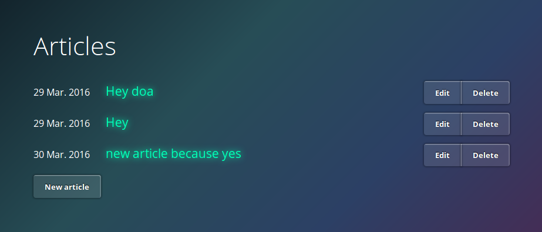

# README

This is a more advanced app to simulate a blog where you have to log in with an admin account in order to perform cRUD operations on the database.

You can access the app here https://railstwittersample.herokuapp.com




## How to setup the project

This project uses Sqlite. Be sure you have it installed in your system before installing the gems. If you don't, type:

```bash
sudo apt-get install sqlite3 libsqlite3-dev
```

The install all the gems:

```bash
bundle install
```


## Running the tests

Ensure that the files in the `bin` directory have the right permissions:

```bash
chmod +x bin/*
```

Make sure all the migrations have run:

```bash
bundle exec bin/rake db:migrate RAILS_ENV=test
```

And then

```bash
bundle exec rake
```

To run the test suite in pride mode type `bundle exec bin/rake test TESTOPTS='--pride'`


## Running the app

Make sure all the migrations have run:

```bash
bundle exec bin/rake db:migrate RAILS_ENV=development
bundle exec rake db:setup
```

And then

```bash
bundle exec rails s
```

Then go to <http://localhost:3000/>


To start the app in production do `bin/rails s -e production`


## Installing the Heroku cli


You can install the heroku cli as a gem, but it is better to [install it in your system](https://devcenter.heroku.com/articles/heroku-cli) so that it is available to you for any language and not only in Ruby.


## Pushing to Heroku

Pushing to heroku will deploy the application.

Make sure you have an account in Heroku and log in:

```bash
heroku login
> Enter your Heroku credentials:
> Email: user@example.com
> Password: ***********
> Logged in as user@example.com
```

Create the app if it doesn't exist yet

```bash
heroku create
```

Make sure that the app is in your remotes

```bash
heroku git:remote -a yourapp
```

Then push

```bash
git push heroku master
```


## License

[](https://opensource.org/licenses/GPL-2.0)
GNU License

